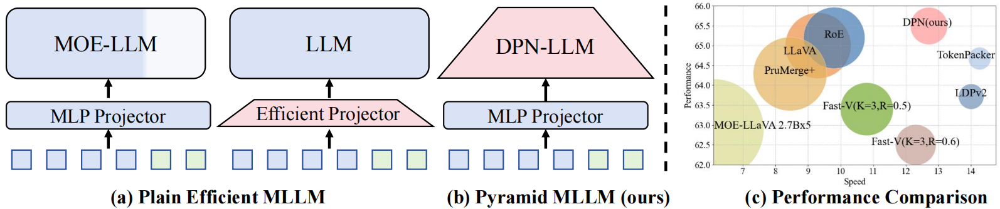
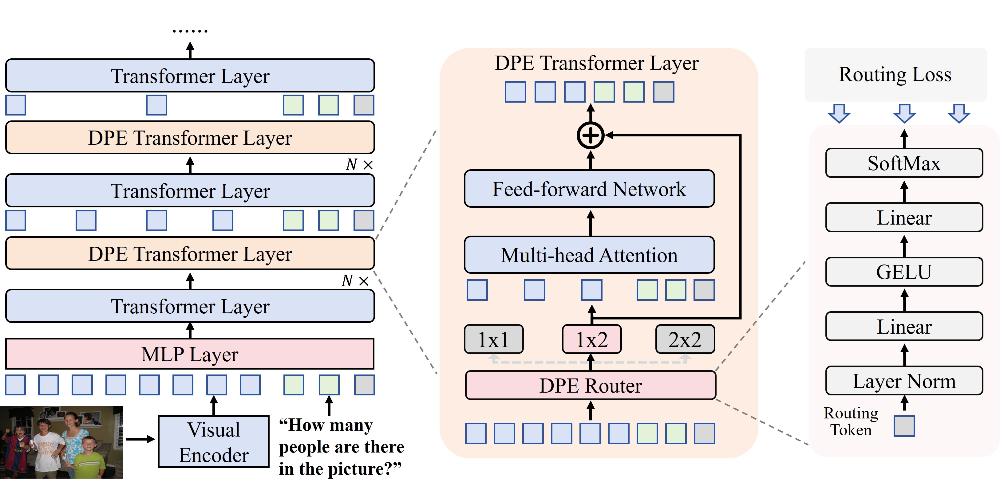
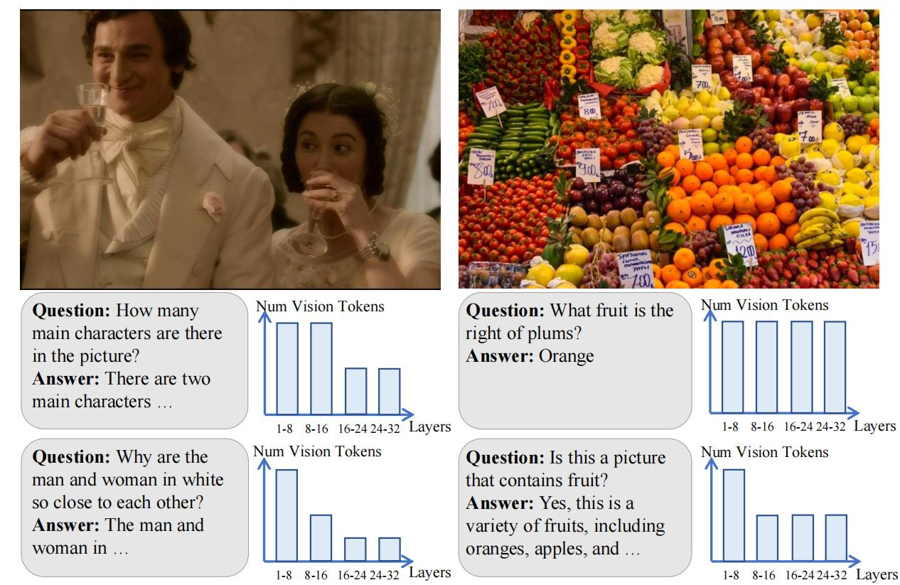
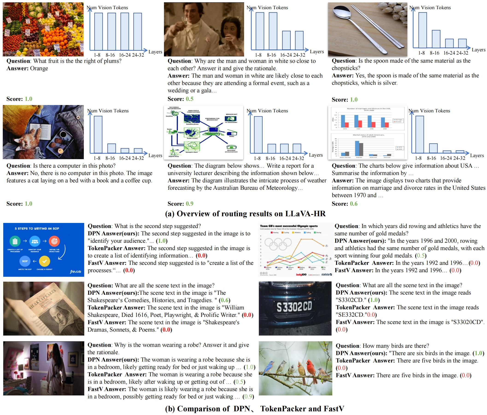

# $DPN$: Dynamic Pyramid Network for Efficient Multimodal Large Language Model

[]()
[]()
[]([https://huggingface.co/collections/AisingioroHao0/dpn-llava](https://arxiv.org/abs/2503.20322))
[](https://huggingface.co/collections/AisingioroHao0/dpn-llava)
[](link_to_license)

## 📣 News

- 🤗🤗🤗We release **$DPN$**, a novel approach to enhance computational efficiency in Multimodal Large Language Models (MLLMs) by incorporating **Dynamic Pooling Experts (DPE)** layers.  


## 🔗 Table of Contents

- [Overview](#-overview)
- [Visualization Results](#-visualization-results)
- [Getting Started](#-getting-started)
  - [Installation](#installation)
  - [Data Preparation](#data-preparation)
  - [Training](#training)
- [Experiments](#-experiments)
- [Results](#-results)
- [Citation](#-citation)
- [Contact](#-contact)
- [License](#-license)


## 🚀 Overview

Dynamic Pyramid Network (**$DPN$**) is a novel approach to enhance computational efficiency in Multimodal Large Language Models (MLLMs) by introducing Pyramid Network and **Dynamic Pooling Experts(DPE)** layers.  Compared with direct compression methods such as FastV and TokenPacker, it can better preserve the detailed visual perception ability of MLLMs.



### 💡 Motivation

Multimodal large language models (MLLMs) have demonstrated impressive performance in various vision-language (VL) tasks, but their expensive computations still limit the real-world application.  To address this issue, recent efforts aim to compress the visual features to save the computational costs of MLLMs. However, direct visual compression methods, such as efficient projectors, or token pruning approaches like Fast V, inevitably destroy the visual semantics in MLLMs, which becomes more serious in difficult samples.

DPN formulates MLLM as a hierarchical structure where visual features are gradually compressed with increasing depth. In this case, even with a high compression ratio, fine-grained visual information can still be perceived in shallow layers.  To maximize the benefit of DPN, we further propose an innovative Dynamic Pooling Experts (DPE) that can dynamically choose the optimal visual compression rate according to input features.  With this design, harder samples will be assigned larger computations, thus preserving the model performance.

### ⭐ Key Features:

- **Dynamic Pyramid Network**: Visual features are compressed as the depth of MLLM increases, maintaining performance while improving inference efficiency.
- **Dynamic Pooling Experts**: Choose the optimal compression ratio based on the complexity of the image and visual questions to ensure performance and efficiency.
- **Routing Loss**: Improve the acceleration effect without affecting training cost and performance.



## 📊 Efficiency Gains

$DPN$ was tested on **Two popular MLLMs** across **10 benchmark datasets**.

| Model              | FLOPs Ratio Reduction | Accuracy |
| ------------------ | --------------------- | -------- |
| DPN-LLaVA-1.5-7B   | 56%                   | +0.7%    |
| DPN-LLaVA-HR-7B    | 40%                   | -0.4%    |
| DPN-LLaVA-HR-X-13B | 44%                   | +0.6%    |

For more details, check the full report.

---

## 🎨 Visualization Results

Our DPN Approach can dynamically compress visual tokens according to the complexity of visual tasks in MLLM to accelerate reasoning, and significantly outperforms existing acceleration methods in fine-grained visual perception tasks.







### Key Observations:

1. **Efficient Inference Structure** : As shown in Figure 4a, in DPN-LLaVA, the deeper the layer, the fewer visual tokens need to be processed to achieve efficient inference.

2. **Dynamic Optimal Compression**: As shown in Figure 3, 4a, DPE can dynamically select the appropriate compression ratio based on the complexity of the image and the problem to ensure low performance loss.

3. **Superior performance compared to existing methods**: As shown in Figure 4b, compared to sparsification methods like Fast V and efficient projector approaches like TokenPacker, our dynamic compression method demonstrates significant advantages in image detail perception tasks.

This visualization demonstrates how $DPN$ effectively reduces computational overhead while maintaining the model's ability to process and respond to complex multimodal inputs.

---

## 🛠️ Getting Started

### Installation

1. Clone the repository and navigate to the $DPN$ folder:

```bash
git clone https://github.com/anonymous/DPN-LLaVA.git
cd DPN-LLaVA
```

2. Create and activate a new conda environment:

```bash
conda create -n dpn-llava python=3.10 -y
conda activate dpn-llava
```

3. Upgrade pip and install the package:

```bash
pip install --upgrade pip  # enable PEP 660 support
pip install -e .
```

4. Install additional packages for training:

```bash
pip install ninja
pip install flash-attn==2.6.3 --no-build-isolation
```

### Data Preparation

Please refer to the original [LLaVA-HR](https://github.com/luogen1996/LLaVA-HR/tree/main) for data preparation. Or whatever MLLM's offical repo you are using.

### Models Preparation

We recommend to directly pre-trained projector, here are the link from official LLaVA and LLaVA-HR. You can use the following script to download the pre-trained projectors used in this project.

| Version        | Vision Encoder        | Projection | Pretrain Data | Pretraining schedule | Download                                                     |
| -------------- | --------------------- | ---------- | ------------- | -------------------- | ------------------------------------------------------------ |
| LLaVA-7b       | CLIP-L                | MLP-2x     | LCS-558K      | 1e                   | [projector](https://huggingface.co/liuhaotian/llava-v1.5-7b) |
| LLaVA-HR-7b    | CLIP-L & ConvNeXt-L   | MLP-2x     | LCS-558K      | 1e                   | [projector](https://huggingface.co/favor123/llava-hr-7b-pretrain-384) |
| LLaVA-HR-X-13b | CLIP-L & ConvNeXt-XXL | MLP-2x     | LCS-558K      | 1e                   | [projector](https://huggingface.co/favor123/llava-hr-13b-x-sft-1024) |


```shell
huggingface-cli download --local-dir ./checkpoints/vicuna-7b-v1.5 lmsys/vicuna-7b-v1.5 
# for dpn-llava
huggingface-cli download --local-dir ./checkpoints/llava-v1.5-7b llava-v1.5-7b mm_projector.bin 
# for dpn-llava-hr
huggingface-cli download --local-dir ./checkpoints/llava-hr-7b-pretrain-384 favor123/llava-hr-7b-pretrain-384 mm_projector.bin
# for dpn-llava-hr-x
huggingface-cli download --local-dir ./checkpoints/vicuna-13b-v1.5 lmsys/vicuna-13b-v1.5
huggingface-cli download --local-dir ./checkpoints/llava-hr-13b-x-pretrain-384 favor123/llava-hr-13b-x-pretrain-384 mm_projector.bin
```

### Training

For the 13B model, you may need to modify the parameters used by the hack_llava function in the llava_hr/train/train.py file.

```shell
bash scripts/v1_5/train_dpn_llava.sh
bash scripts/v1_5/train_dpn_llava_hr.sh
bash scripts/v1_5/train_dpn_llava_hr_x.sh
```

## ⚖️ Evaluation

We follow  [LLaVA-v1.5](https://github.com/haotian-liu/LLaVA/tree/main) to conduct evaluations. you should download [eval.zip](https://drive.google.com/file/d/1atZSBBrAX54yYpxtVVW33zFvcnaHeFPy/view?usp=sharing) and unzip it to `./playground/data/eval`. Please refer to [Evaluation.md](./Evaluation.md) to prepare the data.   

Then, your can run our evaluation script `bash scripts/v1_5/eval.sh`. 

---

## 📧 Contact

For questions, please reach out to [aihao](aihao2000@outlook.com).

---

## 📜 License

This project is licensed under the MIT License - see the [LICENSE](LICENSE) file for details.

---

## 👀 Acknowledgments

Special thanks to all contributors and the [LLaVA](https://github.com/haotian-liu/LLaVA) & [LLaVA-HR](https://github.com/luogen1996/LLaVA-HR) project for codebase.
